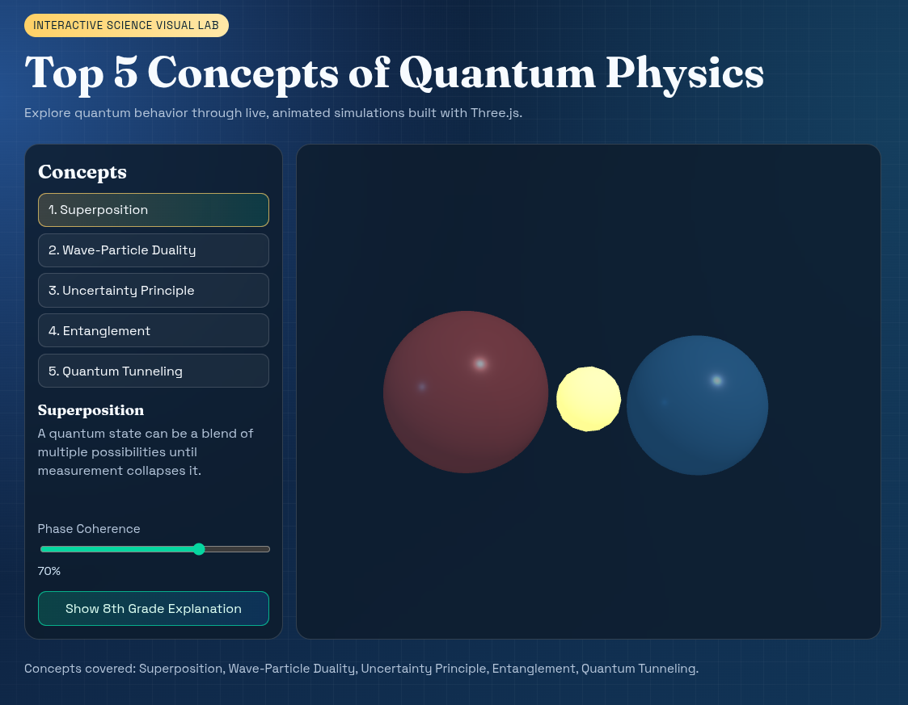

# Quantum Physics Explorer


A lightweight Web UI illustrating five major concepts in quantum physics using Three.js animations, served by Python3.

## UI Preview



## Concepts Visualized

1. Superposition
2. Wave-Particle Duality
3. Uncertainty Principle
4. Entanglement
5. Quantum Tunneling

## Run Locally

```bash
python3 app.py
```

Then open: http://127.0.0.1:8000

Optional:

```bash
python3 app.py --host 0.0.0.0 --port 8080
```
